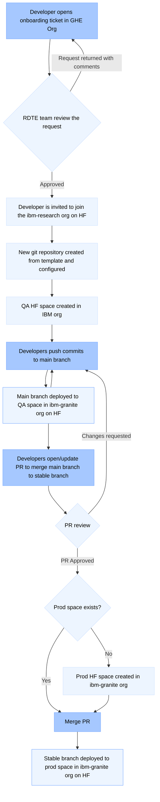

# IBM Research Hugging Face Spaces gradio template

This template repository lets you quickly build a [gradio](https://www.gradio.app/) Hugging Face spaces demo for the [ibm-granite org](https://huggingface.co/ibm-granite). It is set up with the requirements, theming and analytics for the ibm-granite org as well as pre-commit hooks and linting configuration to maintain a consistent code standard across all demos.

## 👩‍💻 Introduction

To deploy demos to the ibm-granite org on Hugging Face, you will be working with the Research Design Technical Experiences (RDTE) team via this GitHub org. You will not gain access to the ibm-granite Hugging Face org as there are limited seats available. Hence, you will work via the RDTE team (who have write access) to create and deploy demos to Hugging Face.

## 🛠️ Getting started

This is the place to start when building gradio demos for IBM Granite. Complete the following steps to get a repository set up and configured for your demo as well as the deployment pipeline to validate and push it to Hugging Face spaces.

1. [Raise an onboarding request](https://github.ibm.com/ibm-huggingface-space-demos/deployment/issues/new?assignees=james-sutton,gwhite&labels=onboarding%2Ctriage&projects=&template=onboarding.yaml&title=%5BOnboarding%5D%3A+). Please fill the templated onboarding request to get a new repository set up for you in this org and to give access to anything else required.
2. Once your repository has been created, please either update it with your existing demo if you have one, or have a play with the example and modify it to create your new demo. You'll be working in the `main` branch whilst developing your demo. Your `main` branch is linked to the "QA" instance of your demo in the IBM org on Hugging Face.
3. Make sure that you follow this development guide and use the pre-configured pre-commit hooks before every commit and push.
4. Once you are happy with your demo and want to get it deployed into production on Hugging Face spaces in the ibm-granite org, open a pull request to merge the `main` branch into the `stable` branch. The RDTE team will validate the demo works well both from a technical and UX standpoint. If your demo needs any custom environment variables or secrets, let the RDTE team know and we will contact you directly to get them added to the Space configuration on Hugging Face.
5. Once the Pull request has been approved, you can merge it into the `stable` branch. A deployment will then push your changes to Hugging Face spaces where it will build and become available for use. Initially, both the "QA" and "Production" versions of your demo will be marked as private and only visible to members of the ibm-research org (QA) and ibm-granite org (production) that have logged into Hugging Face. The "QA" version will always remain private in the ibm-research org. However, when the RDTE team are happy to publish the demo to stable, they will mark the "Production" version as public in the ibm-granite org.

### Onboarding Process Summary

The following diagram explains the onboarding process. Actions that you, the developer, take are shown in darker blue. Actions that we, the RDTE team, take are shown in lighter blue. The lighter blue steps that have darker borders are automations maintained by the RDTE team, these steps require no manual intervention.



## 🛠️ Development guide

Further information on developing the code in this repository is provided below.

### Clone your code repository

Once you have been notified that your code repository has been created in this org, you can clone it to your local machine and start work.

If you just want to play with our template, you're welcome to [use it](https://github.ibm.com/new?template_name=gradio-template&template_owner=ibm-huggingface-space-demos) to create a new code repository in another org. Later, for deployment, you wil need to move your code to the repository created in this org.

### Prerequisites

Some things you will need to do on your machine before developing.

#### Precommit

[Precommit](https://pre-commit.com) is a tool that adds git commit hooks. You will need to [install](https://pre-commit.com/#install) it on your machine and then run within your code repository:

```shell
pre-commit install
```

You can manually run pre-commit using the following command:

```shell
# To run against staged files:
pre-commit run

# If you want to run against staged and unstaged files:
pre-commit run --all-files
```

It is important to run the pre-commit hooks and fix any files that fail before you commit and push to the repository as the pull request build will fail any PR that does not adhere to them i.e. the RDTE team will only accept your code for deployment to Hugging Face once it has passed all of the pre-commit checks.

#### Poetry

[Poetry](https://python-poetry.org/) is a tool for Python packaging, dependency and virtual environment management that is used to manage the development of this project. You will need to install Poetry locally. There are several ways to install it including through the package manager of your operating system, however, the easiest way to install is likely using their installer, as follows:

```shell
curl -sSL https://install.python-poetry.org | python3 -
```

You can also use `pip` and `pipx` to install poetry, the details of which are at https://python-poetry.org/docs/

Once installed, the project is configured and controlled via the `pyproject.toml` file with the current dependency tree stored in `poetry.lock`. You may also [configure poetry](https://python-poetry.org/docs/configuration/) further if you wish but there is no need to do so as the default options are sufficient. You may, however, wish to change some of the options set in this template:
| Setting | Notes |
| ------- | ----- |
| name | **Update this**, to reflect the name of your demo |
| version | **Update this**, to reflect the current version of your demo |
| description | **Update this**, to a short description of your demo |
| authors | **Update this**, to the list of authors of your demo |

## 🛠️ Install and run locally

To get set up ready to run the code in development mode:

```shell
# add the poetry shell and export plugins (you only need to do this once on your machine)
poetry self add poetry-plugin-shell
poetry self add poetry-plugin-export

# create and activate a python virtual environment
poetry shell
poetry install

# run the demo locally (for development with automatic reload)
gradio src/app.py
```

## 📝 Documenting your demo

If you would like to write some information/documentation about your demo that is intended for developers or other people that might want to run the demo from scratch, please use the [README.md](README.md) file, leaving the Hugging Face Spaces configuration header in place at the top of the file.

### Hugging face spaces configuration settings

Hugging Face allow the configuration of spaces demonstrations via the [README.md](README.md) file in the root of the project. There is a [Spaces Configuration Reference](https://huggingface.co/docs/hub/en/spaces-config-reference) guide that you can use to gain an understanding of the configuration options that can be specified here.

The template has a set of initial defaults, similar to these:

```
---
title: Granite 3.0 Chat
colorFrom: blue
colorTo: indigo
sdk: gradio
sdk_version: 5.9.1
app_file: src/app.py
pinned: false
license: apache-2.0
short_description: Chat with IBM Granite 3.0
---
```

#### Options

The default options specified above:
| Setting | Notes |
| ------- | ----- |
| title | **Update this**, keep this short (recommend max 24 chars), this information is displayed in the centre of the demo description card |
| emoji | Do not update this, our demos will use a consistent emoji character |
| colorFrom | Do not update this, used in combination with colorTo to colourize the demo description card |
| colorTo | see colorFrom |
| sdk | Do not update this, our Gradio demos will always use the "gradio" setting |
| sdk_version | Update this if necessary for your demo to function, ideally should be set to the latest gradio version |
| app_file | Update this if necessary for your demo to function, should be set to the path of the main entry point to the demo |
| license | Do not update this, our demos are to always be apache-2.0 licensed |
| short_description | **Update this**, should be set to a few words that describe the demo in a little more detail than the title, this information is displayed in the bottom-right of the demo description card |

Other available options:
| Setting | Notes |
| ------- | ----- |
| python_version | You may optionally set this, best advice is to use the default Python version if possible (current default is Python 3.10) |
| suggested_hardware | Do not use this, unlikely to be required as demos run on ZeroGPU |
| suggested_storage | Do not use this, our demos do not require storage |
| app_port | Do not use this, not relevant for gradio demos |
| base_path | Do not use this, use the app_file setting |
| fullWidth | Do not use this, our demos will use a consistent default width |
| header | Do not use this, our demos will use a consistent header |
| models | Do not use this, let their parsing discover these from our code |
| datasets | Do not use this, let their parsing discover these from our code |
| tags | Do not use this, we are not tagging our demos |
| thumbnail | Do not use this, provides a thumbnail for social sharing of demos |
| pinned | Do not use this, the RDTE team will change this setting if it's deemed necessary |
| hf_oauth | Do not use this, we are not using OAuth |
| hf_oauth_scopes | Do not use this, we are not using OAuth |
| hf_oauth_expiration_minutes | Do not use this, we are not using OAuth |
| disable_embedding | Do not use this, leave at the default that allows embedding to take place |
| startup_duration_timeout | Do not use this, leave at the default 30 minutes |
| custom_headers | Do not use this, we do not need to add any custom HTTP headers |
| preload_from_hub | Do not use this, specifying this builds the models and data sets into the container image with the goal of making start up times faster due to not needing to download them each time. However, RDTE testing indicates this setting significantly increases the start up time for our relatively small Granite models |
